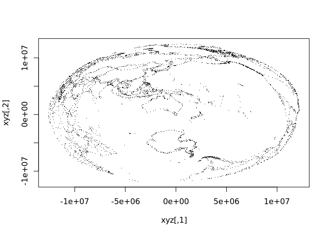
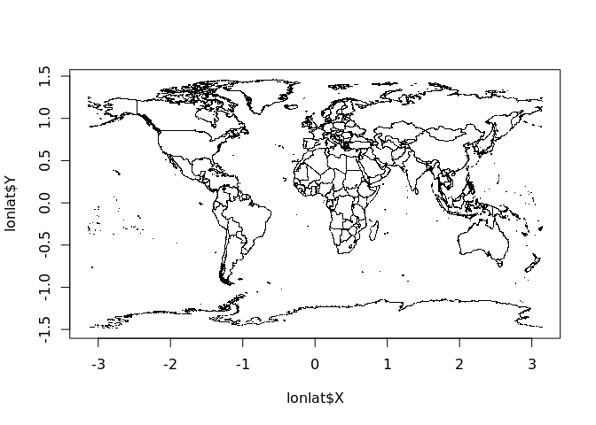
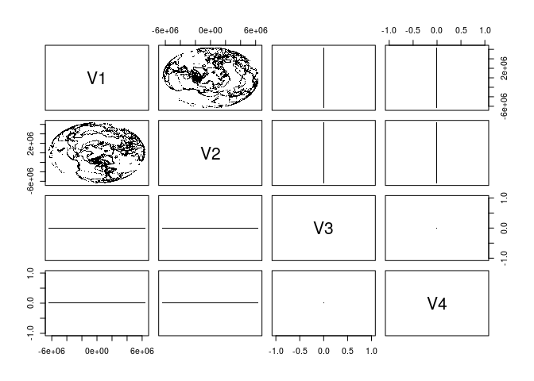

<!-- README.md is generated from README.Rmd. Please edit that file -->

# PROJ

<!-- badges: start -->

[](https://www.tidyverse.org/lifecycle/#experimental)
[](https://github.com/hypertidy/PROJ/actions)
[](https://github.com/hypertidy/PROJ/actions)
[](https://github.com/hypertidy/PROJ/actions)
[](https://cran.r-project.org/package=PROJ)
[](https://cran.r-project.org/package=PROJ)

[](https://travis-ci.org/hypertidy/PROJ)
no PROJ available 👍 <br> [](https://travis-ci.org/hypertidy/PROJ)
PROJ.4 in system, no function 👍 <br> [](https://travis-ci.org/hypertidy/PROJ)
PROJ 5 in system, no function 👍 <br> [](https://travis-ci.org/hypertidy/PROJ)
PROJ version 6, full function 🚀 <br> [](https://travis-ci.org/hypertidy/PROJ)
PROJ version 7, full function 🤸 <!-- badges: end -->

The goal of PROJ is to provide generic coordinate system transformations
in R with a functional requirement for the system library PROJ \>= 6.

This is same goal as the
[reproj](https://cran.r-project.org/package=reproj) package, but
provided for later versions of the underlying library. Reproj currently
uses PROJ 4 or 5 via the proj4 package, so PROJ augments that coverage
for the more modern library versions.

I need basic coordinate transformations for matrices or data frames with
efficient vectors of coordinate fields. Constantly unpacking and packing
basic data from formats is labourious, error-prone, and brittle.
Transforming spatial data coordinates is a basic task.

PROJ is strictly for version 6.0.0 or higher of the PROJ library. The
intention is that this package will be used for when that version is
available, and this package can be compiled and installed even when it
cannot do anything. For older versions of PROJ (5, and 4) we can use the
proj4 package.

Because we are version 6 or above only, there is no forward/inverse
transformation, only integrated source/target idioms. This is the same
approach taken by the reproj package- the source must be provided as
well as the target. When a data set has an in-built CRS projection
recorded, then methods can be written for that use-case with that
format.

We can use “auth:code” forms, PROJ.4 strings, full WKT2, or the name of
a CRS as found in the PROJ database, e.g “WGS84”, “NAD27”, etc. Full
details are provided in the [PROJ
documentation](https://proj.org/development/reference/functions.html#c.proj_create).

## Things to be aware of

Note that for PROJ5 (and lower) this package is non-functional (can use
proj4). The testing here on Travis ensures that the package installs
successfully for various versions of PROJ, although underlying
functionality is disabled for 4 and 5 (and for no PROJ).

  - Input can be a data frame or a matrix, but internally input is
    assumed to be x, y, z, *and time*. So the output is always a
    4-column matrix.
  - You can’t use strings like “+init=epsg:4326” any more, it must be
    “epsg:4326”.
  - You should know what your target projection is, and also what your
    source projection is. This is your responsibility.

Personally, I need this low-level package in order to develop other
projects. I don’t care about the big snafu regarding changes in version
6 and whatever, we should have low-level tools and then we can code at
the R level to sort stuff out. A text-handler for various versions and
validations of CRS representations would be good, for instance we can
just gsub out “+init=” for those sorts of things, and being able to
write “WGS84” as a valid source or target is a massive bonus.

## WHY

This package strips code out of the development version of proj4, with
attribution to the author.

  - Why not proj4? It’s not maintained in a way that works for me.
  - Why not sf? It brings a lot of baggage, and can’t do geocentric
    transformations.
  - Why not rgdal? Still baggage, no transformations possible without
    special data formats, no geocentric.
  - Why not lgeom? That package is format-specific, and does not work
    with generic data coordinates so is unsuitable for many
    straightforward and efficient data-handling schemes.
  - Why not mapproj? This is unusable for real-world projections in my
    experience, it seems to be written for some basic graphics cases.
  - Why not reproj? reproj will be improved by importing PROJ. This is
    an extension for reproj, to bridge it from PROJ version 4 and 5, to
    version 6 and 7 and beyond.

## Installation

WIP - see the matrix set up in .travis.yml, and the scripts in
ci/travis/ - much gratitude to GDAL for examples of how to do all this\!

# Notes

None of these things are dealt with.

  - threading, see the PJ\_CONTEXT
  - coordinate order
  - the zero value after transformation, it comes out like -3.19835e-15
    (do we just zapsmall()?)

<https://proj.org/development/quickstart.html>

## Example

Minimal code example, two lon-lat coordinates to LAEA, and back.

``` r
library(PROJ)
lon <- c(0, 147)
lat <- c(0, -42)
dst <- "+proj=laea +datum=WGS84 +lon_0=147 +lat_0=-42"
src <- "+proj=longlat +datum=WGS84"

## forward transformation
(xy <- proj_trans_generic( cbind(lon, lat), dst, source = src))
#> $x_
#> [1] -8013029        0
#> 
#> $y_
#> [1] -8225762        0
#> 
#> $z_
#> [1] 0 0
#> 
#> $t_
#> [1] 0 0

## inverse transformation
proj_trans_generic(cbind(xy$x_, xy$y_), src, source = dst)
#> $x_
#> [1]   0 147
#> 
#> $y_
#> [1] -3.194835e-15 -4.200000e+01
#> 
#> $z_
#> [1] 0 0
#> 
#> $t_
#> [1] 0 0


## note that NAs propagate in the usual way
lon <- c(0, NA, 147)
lat <- c(NA, 0, -42)
```

A more realistic example with coastline map data.

``` r
library(PROJ)
w <- PROJ::xymap
lon <- na.omit(w[,1])
lat <- na.omit(w[,2])
dst <- "+proj=laea +datum=WGS84 +lon_0=147 +lat_0=-42"
xyzt <- proj_trans_generic(cbind(lon, lat), dst, source = "epsg:4326", z_ = 0)
plot(xyzt$x_, xyzt$y_, pch = ".")
```



``` r

lonlat <- proj_trans_generic(xyzt, src, source = dst)
plot(lonlat$x_, lonlat$y_, pch = ".")
```



## Convert projection strings

We can generate PROJ or within limitations WKT2 strings.

``` r
cat(wkt2 <- proj_create("EPSG:4326"))
#> GEOGCRS["WGS 84",
#>     DATUM["World Geodetic System 1984",
#>         ELLIPSOID["WGS 84",6378137,298.257223563,
#>             LENGTHUNIT["metre",1]]],
#>     PRIMEM["Greenwich",0,
#>         ANGLEUNIT["degree",0.0174532925199433]],
#>     CS[ellipsoidal,2],
#>         AXIS["geodetic latitude (Lat)",north,
#>             ORDER[1],
#>             ANGLEUNIT["degree",0.0174532925199433]],
#>         AXIS["geodetic longitude (Lon)",east,
#>             ORDER[2],
#>             ANGLEUNIT["degree",0.0174532925199433]],
#>     USAGE[
#>         SCOPE["unknown"],
#>         AREA["World"],
#>         BBOX[-90,-180,90,180]],
#>     ID["EPSG",4326]]

## this is not proper WKT2 and cannot be used, compare to sf::st_crs("+proj=etmerc +lat_0=38 +lon_0=125 +ellps=bessel")
cat(proj_create("+proj=etmerc +lat_0=38 +lon_0=125 +ellps=bessel"))
#> CONVERSION["PROJ-based coordinate operation",
#>     METHOD["PROJ-based operation method: +proj=etmerc +lat_0=38 +lon_0=125 +ellps=bessel"]]

proj_create(wkt2, format = 1L)
#> [1] "+proj=longlat +datum=WGS84 +no_defs +type=crs"
```

# Speed comparisons

``` r
library(reproj)
library(rgdal)
library(lwgeom)
library(sf)
#> Linking to GEOS 3.6.1, GDAL 2.2.3, PROJ 4.9.3
#> 
#> Attaching package: 'sf'
#> The following object is masked from 'package:lwgeom':
#> 
#>     st_make_valid
lon <- w[,1]
lat <- w[,2]
lon <- rep(lon, 25)
lat <- rep(lat, 25)
ll <- cbind(lon, lat)
z <- rep(0, length(lon))
llproj <- "+proj=longlat +datum=WGS84"

xyz <- cbind(lon, lat, z)
xyzt <- cbind(lon, lat, z, 0)
# stll <- sf::st_crs(llproj)
# sfx <- sf::st_sfc(sf::st_multipoint(ll), crs = stll) 

rbenchmark::benchmark(
          PROJ = proj_trans_generic(ll, target = dst, source = llproj, z_ = z),
          reproj = reproj(ll, target = dst, source = llproj),
          rgdal = project(ll, dst),
          sf_project = sf_project(llproj, dst, ll),
        # lwgeom = st_transform_proj(sfx, dst),
        # sf = st_transform(sfx, dst),
        replications = 100) %>%
  dplyr::arrange(elapsed) %>% dplyr::select(test, elapsed, replications)
#>         test elapsed replications
#> 1 sf_project    3.51          100
#> 2      rgdal    3.66          100
#> 3     reproj    4.53          100
#> 4       PROJ    5.74          100
```

The speed is not exactly stunning, but with PROJ we can also do 3D
transformations and that’s good enough for me. I think it will be faster
with the underlying API function `proj_trans_array()`, instead of
`proj_trans_generic()`, but I don’t really know.

A geocentric example, suitable for plotting in rgl and used extensively
with quadmesh, silicate, and anglr.

``` r
xyzt <- proj_trans_generic(cbind(w[,1], w[,2]), target = "+proj=geocent +datum=WGS84", source = "EPSG:4326")
plot(as.data.frame(xyzt[1:3]), pch = ".", asp = 1)
```



Geocentric transformations aren’t used in R much, but some examples are
found in the [quadmesh](https://CRAN.R-project.org/package=quadmesh) and
[anglr](https://github.com/hypertidy/anglr) packages.

## Why PROJ?

The [reproj](https://CRAN.R-project.org/package=reproj) package wraps
the very efficient `proj4::ptransform()` function for general coordinate
system transformations. Several package now use reproj for its
consistency (no format or plumbing issues) and efficiency (directly
transforming bulk coordinates). The proj4 package used by reproj doesn’t
provide the modern features of PROJ (PROJ.4), has not been updated on
CRAN since 2012 and has an uncertain future. So reproj requires a new
wrapper around PROJ (PROJ.4) itself.

Since the 1990s [PROJ.4](https://proj4.org) has been the name of the
common standard library for general coordinate system transformations
(for geospatial). That 1994 release has been modernized and now has
versions **PROJ 5** and **PROJ 6**. There’s a bit of traction in the
name PROJ.4, so it has stuck

I’ll use “PROJ (PROJ.4)” to distinguish the [system
library](https://proj4.org) from [this
package](https://github.com/hypertidy/PROJ).

There are a few links to the PROJ (PROJ.4) library in R.

  - [rgdal](https://CRAN.R-project.org/package=rgdal) Provides low level
    `project(matrix, inv = TRUE/FALSE)`, and engine behind
    `sp::spTransform()`.
  - [proj4](https://CRAN.R-project.org/package=proj4) Provides low level
    `project()` and `ptransform`.
  - [sf](https://CRAN.R-project.org/package=sf) Provides low level
    `sf::sf_project()` transformation of matrices. Provides high level
    `st_transform()` which works via the GDAL library and its own
    internal version of PROJ (PROJ.4). The high level function converts
    coordinates in list heirarchies of matrices into WKB for the
    transformations.
  - [lwgeom](https://CRAN.R-project.org/package=lwgeom) Provides high
    level `st_transform_proj()` also converts coordinates in list
    hierarchies of matrices into WKB, but internally uses the PROJ
    (PROJ.4) library directly.

(The [mapproj](https://CRAN.R-project.org/package=mapproj) package uses
all its own internal code).

Packages sf, rgdal and proj4 provide raw access to coordinate
transformations for R vectors. `sf::sf_project()` is the winner, but is
embedded in a package that does many other things. Rgdal only has
project forward and project inverse and always works in degrees proj4
has the more general `ptransform()` but requires manual conversion of
degree values into radians. PROJ (PROJ.4) internally works only with
radians.

The rgdal function `project()` won’t transform with a third Z
coordinate. The sf functions do work with geocentric coords.

The packages rgdal, sf, lwgeom are now compatible with PROJ 5 (and 6)
and don’t need any further attention in this regard. They work fine
within their chosen context.

Are there any other wrappers around PROJ (PROJ.4) on CRAN or
Bioconductor, or in the works? Let me know\!

-----

Please note that the PROJ project is released with a [Contributor Code
of
Conduct](https://github.com/hypertidy/PROJ/blob/master/CODE_OF_CONDUCT.md).
By contributing to this project, you agree to abide by its terms.
